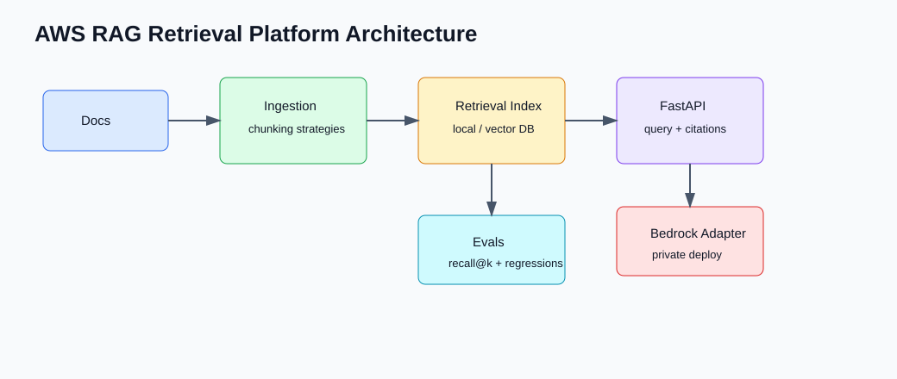
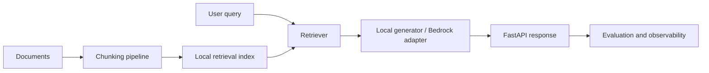

# AWS RAG Retrieval Platform

A small retrieval service for experimenting with chunking, retrieval evaluation, and an optional Bedrock generation path.

The default mode is local: sparse retrieval plus a grounded response formatter. Bedrock is behind an environment flag so the repo can be tested without AWS credentials.

## Features

- markdown/txt ingestion
- heading-aware and fixed-size chunking
- local sparse retrieval index
- recall@k regression evaluation
- FastAPI query endpoint with citations and retrieved context
- optional Bedrock adapter via `RAG_GENERATOR=bedrock`
- Prometheus-style `/metrics`
- Docker Compose stack with Prometheus and OpenTelemetry collector

## Local Quickstart

```bash
python3 -m venv .venv
source .venv/bin/activate
pip install -r requirements.txt
uvicorn rag_platform.main:app --reload --app-dir src
```

Build and evaluate the local index:

```bash
python3 scripts/build_index.py --docs sample_docs --out local_index.json
python3 scripts/evaluate.py --index local_index.json --cases evals/regression_qa.json --json
python3 scripts/benchmark_chunking.py
```

Ask the API:

```bash
curl -X POST http://127.0.0.1:8000/query \
  -H 'Content-Type: application/json' \
  -d '{"question":"How does the platform handle missing secrets?"}'
```

## Common Commands

```bash
make test
make index
make eval
make benchmark
```



## Docker Compose

```bash
docker compose up --build
```

The stack starts the API, Prometheus, and an OpenTelemetry collector. Keep `RAG_GENERATOR=local` for normal development. Use `RAG_GENERATOR=bedrock` only when AWS credentials, `BEDROCK_MODEL_ID`, and `AWS_REGION` are configured.

Do not commit AWS credentials or real environment files. `.env` is ignored by git; `.env.example` contains placeholders only.

## Architecture



## Project Layout

- `src/rag_platform/` - retrieval, generation, API, and evaluation logic
- `scripts/` - index building and evaluation commands
- `sample_docs/` - safe demo corpus
- `docs/` - architecture, evals, runbook, failure modes, AWS design
- `infra/terraform/` - deployment contract skeleton

## Notes

The retrieval implementation is intentionally simple and deterministic. That makes chunking and eval changes easy to reason about before swapping in a managed vector store.
